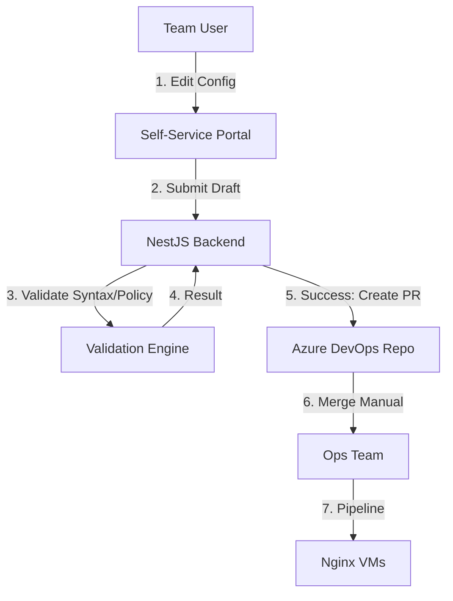

# Design: Secure Nginx Gateway Portal

## Architecture Overview

The system bridges the gap between untrusted internal teams and the mission-critical Nginx Gateway infrastructure. It uses a "Padded Cell" approach where the UI/Backend enforces all constraints before generating standard Nginx config files.

## Component Design

### 1. Data Model & Storage

- **Source of Truth**: The Azure DevOps Git Repository.
  - Structure: `/nginx/{env}/{team_name}/proxy.conf` & `/nginx/{env}/{team_name}/upstreams.conf`.
- **Portal State**: InMemory/Transient or Cached locally, but always rehydrated from Git.

### 2. The "Padded Cell" Editor

- **UI**: A dual-view editor (Wizard Form <-> Raw Text).
- **Parser**: A robust Nginx config parser is required in the browser/backend to convert `location` blocks to form state and vice versa.
- **Restriction**:
  - `location` path MUST start with `/api/{team_name}` or `/static/{team_name}`.
  - `upstream` names MUST be prefixed `upstream {team_name}_{backend_name}`.

### 3. Validation Engine (The Gatekeeper)

- **Syntax Check**: Use `nginx -t` with a mocked master config or a rigorous parser-based validator.
- **Policy Check**:
  - Scan for forbidden directives (`root`, `lua_*`, `access_by_lua`, etc.).
  - Check for path collision against existing configs (requires reading all repo configs).

### 4. GitOps Integration

- **Client**: `azure-devops-node-api`.
- **Flow**:
  1. Create a feature branch `feature/config-update-{team_name}-{timestamp}`.
  2. Commit `proxy.conf` and `upstreams.conf`.
  3. Create PR targeting `dev` (or specific env branch).
  4. Return PR URL to user.

## Environment Strategy

- **Environments**: Dev, UAT, Prod.
- **Promotion**: No auto-promotion. User manually copies config in UI to next env tab and submits new PR.
