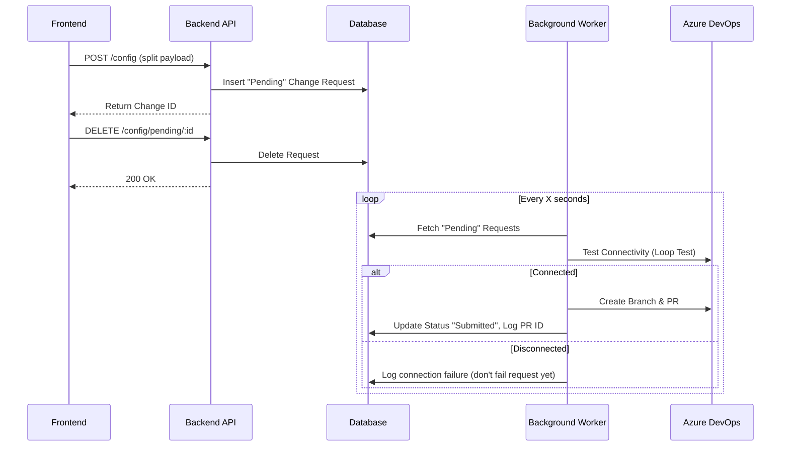

# Design

## Architecture

## Database Schema

New table `change_requests`:

- `id`: UUID
- `team`: string
- `environment`: string
- `upstreams_config`: JSON/Text
- `locations_config`: JSON/Text
- `status`: PENDING | SUBMITTED | FAILED
- `pr_id`: string (nullable)
- `created_at`: timestamp
- `updated_at`: timestamp

## Config Splitting

- Frontend will send `{ upstreams: string, locations: string }`.
- Backend validation will validate blocks individually.
- Nginx generation will concatenate them.

## API Changes

- `POST /api/nginx/:team/submit/:env`: Submits a change request.
- `GET /api/nginx/:team/pending`: Lists pending requests.
- `DELETE /api/nginx/:team/pending/:id`: Abandons a pending request.
